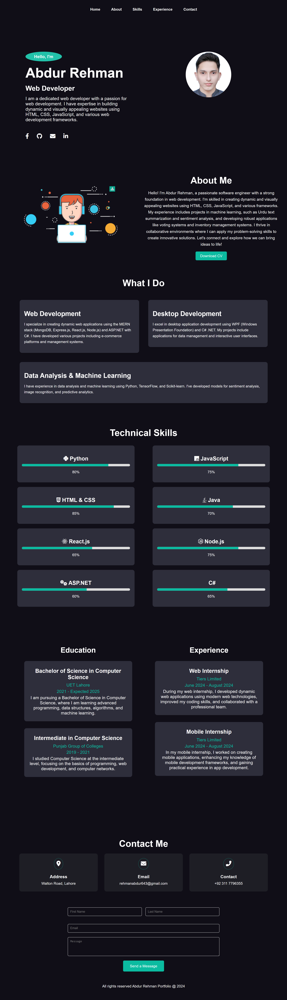

# Responsive Portfolio 💼

Welcome to my **Responsive Portfolio** repository! This project is a clean and modern personal portfolio website built entirely with HTML and CSS. The design is fully responsive, making it accessible on all devices, from desktops to smartphones.



## Features ✨

- **Responsive Design:** Adapts to various screen sizes for a seamless experience.
- **Modern Layout:** Simple yet professional layout showcasing different sections.
- **Easy Navigation:** Includes sections like Home, About, Skills, Experience, and Contact.
- **Pure HTML & CSS:** No frameworks, just clean and efficient code.

## Sections 📂

- **Home:** A welcoming section with a brief introduction.
- **About:** A detailed overview of who you are.
- **Skills:** Highlights your technical skills and expertise.
- **Experience:** Showcases your professional journey and achievements.
- **Contact:** A simple form for visitors to reach out to you.

## Usage 🚀

Clone the repository and open the `index.html` file in your browser to view the portfolio.

```bash
git clone https://github.com/Abdur-Rehman-643/Responsive-Portfolio.git
cd Responsive-Portfolio
open index.html
```
